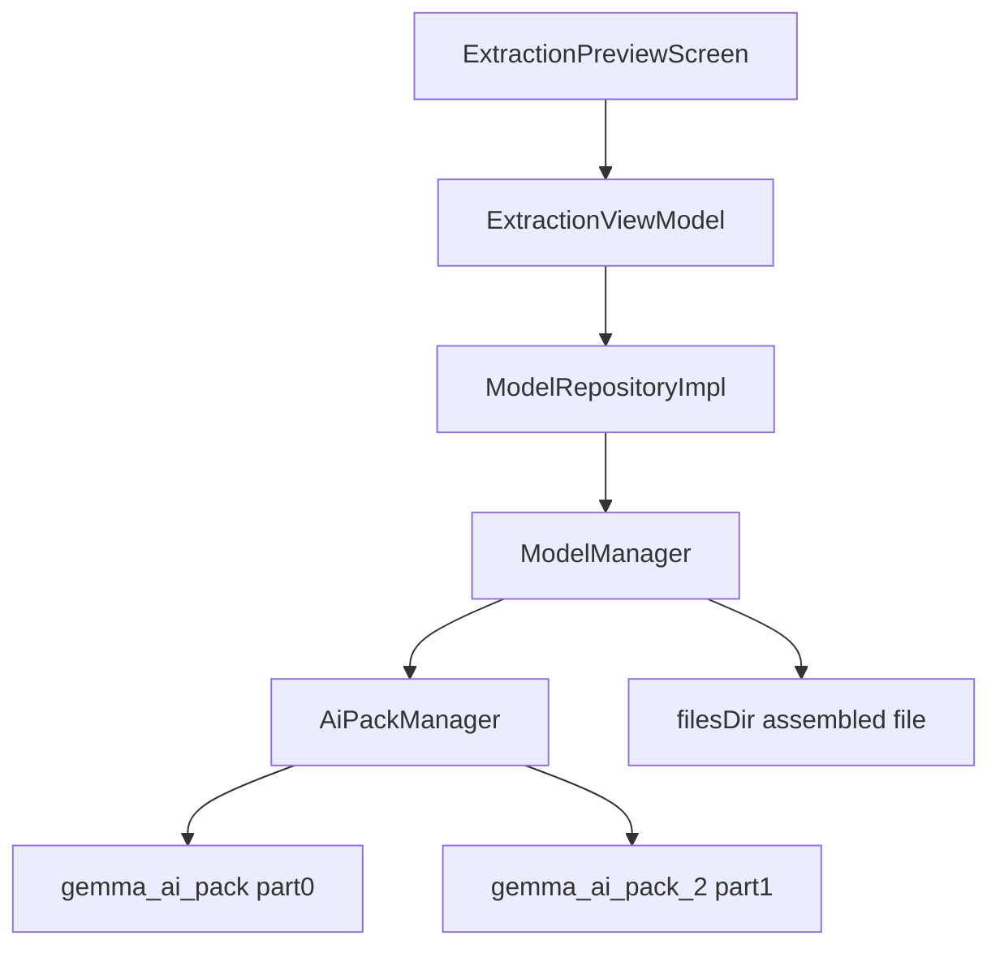

# ScanCard AI Pack Delivery — Design Document

## Overview

Gemma 4 E2B (2.6GB) is delivered as two on-demand AI Packs because of the Play 1.5GB/pack compressed limit. `ModelManager` (`@Singleton`, Hilt) is the only component that talks to `AiPackManager`; `ModelRepositoryImpl` exposes its `StateFlow<ModelState>`; `ExtractionViewModel` forwards `checkModelStatus` / `downloadModel`; `ExtractionPreviewScreen` renders the state. Split parts are concatenated into `filesDir/gemma-4-E2B-it.litertlm` before LiteRT inference.

### Technology Stack

| Layer | Technology | Purpose |
|-------|------------|---------|
| Delivery | `com.android.ai-pack` plugin, `assetPacks.add(":gemma-ai-pack", ":gemma-ai-pack-2")` | On-demand pack packaging |
| Delivery API | `com.google.android.play:ai-delivery:0.2.0-beta01` (`AiPackManager`, `AiPackStateUpdateListener`) | Status query, fetch, progress push |
| DI | Hilt `@Singleton` | `ModelManager`, `ModelRepositoryImpl` bindings |
| UI | Jetpack Compose + Material 3 | `ExtractionPreviewScreen` download states |
| Inference input | LiteRT LM (consumer only) | Reads the assembled file via `getModelPath` |

### Component Diagram



---

## Components and Interfaces

### ModelManager

**Purpose**: Sole owner of pack state, download trigger, progress aggregation, and assembly.

```kotlin
class ModelManager @Inject constructor(@ApplicationContext context: Context) {
    val modelState: StateFlow<ModelState>
    fun checkModelStatus(config: ModelConfig)
    fun downloadModel(config: ModelConfig)
    fun isModelDownloaded(config: ModelConfig): Boolean
    fun getModelPath(config: ModelConfig): String
    internal fun handlePackStates(config: ModelConfig, states: List<AiPackState>)
    internal fun computeAggregateProgress(states: List<AiPackState>): Float
    internal fun tryAssembleSplitModel(config: ModelConfig): File?
    internal fun assembleParts(parts: List<File>, out: File): File?
}
```

State: `activeConfig: ModelConfig?` (listener target), single `packListener` + `listenerRegistered` flag, `directExecutor = Executor { it.run() }` for all Play `Task` callbacks.

### ModelConfig

```kotlin
data class ModelConfig(
    val id: String,
    val name: String,
    val description: String,
    val sizeGb: Double,
    val fileName: String,
    val aiPackNames: List<String>,
    val partFileNames: List<String>
)
// Decided value: GEMMA_4_E2B = id "gemma-4-e2b", fileName "gemma-4-E2B-it.litertlm",
// aiPackNames ["gemma_ai_pack", "gemma_ai_pack_2"],
// partFileNames ["gemma-4-E2B-it.litertlm.part0", "gemma-4-E2B-it.litertlm.part1"], sizeGb 2.6
```

### ModelState

```kotlin
sealed class ModelState {
    object Idle : ModelState()
    data class Downloading(val progress: Float) : ModelState() // 0f..1f
    object Ready : ModelState()
    data class Error(val message: String) : ModelState()
}
```

### ModelRepository

```kotlin
interface ModelRepository {
    val modelState: StateFlow<ModelState>
    suspend fun initializeModel()
    suspend fun downloadModel(config: ModelConfig)
    fun checkModelStatus(config: ModelConfig)
    fun getModelPath(config: ModelConfig): String?
    fun getAvailableModels(): List<ModelConfig>
}
```

`ModelRepositoryImpl` delegates state, status, and download to `ModelManager`; `getModelPath` returns `ModelManager.getModelPath` only when `isModelDownloaded`, else `null`; `getAvailableModels` returns `ModelConfig.AVAILABLE_MODELS`.

---

## Core Behavior

### 1. Status Query (`checkModelStatus`)

- WHEN `File(filesDir, config.fileName)` exists THEN emit `Ready` and return (no Play call).
- ELSE set `activeConfig = config`, register the listener once (`ensureProgressListener`), and run `queryPackStates(config)`.
- `queryPackStates` calls `getPackStates(aiPackNames)` with the direct executor; on success maps `packStates()[name]` per pack (missing entry → `Idle`), then `handlePackStates`; on failure maps `-2`/`PACK_UNAVAILABLE` to the pack-missing hint (`DEBUG` → `Idle`, release → `Error`).

### 2. Download (`downloadModel`)

- Set `activeConfig`, ensure listener, call `fetch(aiPackNames)` with the direct executor.
- On fetch success: reflect the returned `AiPackStates` snapshot via `handlePackStates` (do not overwrite an existing `Downloading`/`Ready`), then re-query `getPackStates` for補完. Later progress is listener-driven.
- On fetch failure/exception: `DEBUG` → `Idle`, release → `Error`.

### 3. Progress Listener

- Exactly one `AiPackStateUpdateListener` for the singleton lifetime. Each callback filters `state.name() in activeConfig.aiPackNames`, then re-queries `getPackStates` so both split packs aggregate (single-pack push alone never drives the UI).
- `registerListener` failure is logged and swallowed; the one-shot query still provides the current snapshot.

### 4. Status Mapping (`handlePackStates`)

| Pack statuses | Emitted state |
|---------------|---------------|
| All `COMPLETED` | `Ready` (after `tryAssembleSplitModel` attempt) |
| Any `PENDING`, `DOWNLOADING`, `TRANSFERRING` | `Downloading(computeAggregateProgress)` |
| Any `WAITING_FOR_WIFI`, `REQUIRES_USER_CONFIRMATION` | `Downloading(computeAggregateProgress)` (last progress preserved, never `Idle`) |
| Any `FAILED` | `DEBUG` → `Idle`, release → `Error("Pack status check failed")` |
| `CANCELED`, `NOT_INSTALLED`, `UNKNOWN`, missing snapshot | `Idle` |

### 5. Progress Formula (`computeAggregateProgress`)

```kotlin
done = sum(bytesDownloaded); total = sum(totalBytesToDownload)
if (total > 0) return (done / total).coerceIn(0f, 1f)
avgTransfer = average(transferProgressPercentage) / 100f
if (avgTransfer > 0f) return avgTransfer.coerceIn(0f, 1f)
return (modelState as? Downloading)?.progress ?: 0f
```

### 6. Assembly

```pascal
ALGORITHM tryAssembleSplitModel(config)
BEGIN
    out ← File(filesDir, config.fileName)
    IF out.exists THEN RETURN out
    FOR i, packName IN config.aiPackNames DO
        loc ← getPackLocation(packName) ?: RETURN null
        assets ← loc.assetsPath() ?: RETURN null
        part ← File(assets, config.partFileNames[i]) ?: RETURN null
        IF NOT part.exists THEN RETURN null
    END
    RETURN assembleParts(parts, out)
END

ALGORITHM assembleParts(parts, out)
BEGIN
    tmp ← File(out.parent, out.name + ".tmp")
    TRY
        stream-copy parts in order into tmp (8MB buffers)
        IF tmp.length != sum(part.length) THEN delete tmp; RETURN null
        IF NOT tmp.renameTo(out) THEN tmp.copyTo(out, overwrite=true); delete tmp
        RETURN out
    CATCH e THEN delete tmp; RETURN null
END
```

`getModelPath` returns the assembled path, else the assembly result, else `""`. `isModelDownloaded` returns assembled-file existence, else all-parts existence; `getPackLocation` failure yields `false`.

### 7. UI Rendering (`ExtractionPreviewScreen`)

- `Idle`: "Not Installed" + "Download via Google Play" (+ `DEBUG`-only `createDummyModelBtn`).
- `Downloading`: determinate `CircularProgressIndicator(progress)` + `"Downloading <name>... <N>%"`.
- `Ready`: model-ready extraction entry (`extractionStartBtn`).
- `Error`: message + "Retry Status Check" (+ Play-Store dev tip when message contains `-1`).
- `ModelSelector` is disabled while `Downloading` or extracting.

---

## Error Handling

| Condition | Response | Recovery |
|-----------|----------|----------|
| `.aab` misses packs (`PACK_UNAVAILABLE -2`) | Hint with Play Console guidance; `DEBUG` → `Idle`, release → `Error` | Include `assetPacks` in `.aab`, check Play track |
| `fetch` failure / exception | `DEBUG` → `Idle`, release → `Error` | Retry Download |
| Pack `FAILED` | `DEBUG` → `Idle`, release → `Error` | Retry status check / fetch |
| `WAITING_FOR_WIFI` / `REQUIRES_USER_CONFIRMATION` | Stay `Downloading(last progress)` | Call `showConfirmationDialog` from UI layer (future) |
| `registerListener` throws | Log warning, keep one-shot query | Next `check/downloadModel` retries registration |
| Assembly size mismatch / IO error | Delete tmp, return `null`, `getModelPath` → `""` | Re-download packs |

## Testing Strategy

- `ModelManagerTest` (JUnit4 + MockK + fake `AiPackState`/`AiPackStates` subclasses; direct executor makes `Task` callbacks synchronous):
  - AiPack failure / fetch failure in `DEBUG` → `Idle`.
  - `getPackLocation` failure → `isModelDownloaded == false`, no throw.
  - `assembleParts` concatenates in order with exact bytes.
  - `checkModelStatus` registers exactly one listener and emits `Downloading` for `PENDING`.
  - Listener callback re-queries and advances aggregate progress `0% → 50%` (regression test for the stuck-at-0% bug).
  - `TRANSFERRING` and `WAITING_FOR_WIFI` stay `Downloading`, never `Idle`.
  - `computeAggregateProgress` preserves last progress when total is unknown.
- Build gate: `./gradlew :app:compileDebugKotlin :app:testDebugUnitTest` passes.

## Dependencies

| Dependency | Version | Purpose |
|------------|---------|---------|
| `com.google.android.play:ai-delivery` | `0.2.0-beta01` | `AiPackManager`, listener, fetch/states |
| `com.android.ai-pack` plugin | AGP-managed | `:gemma-ai-pack`, `:gemma-ai-pack-2` packaging |
| Hilt | `2.60.1` | `@Singleton` injection |
| Jetpack Compose Material 3 | BOM `2026.08.00` | Download progress UI |
