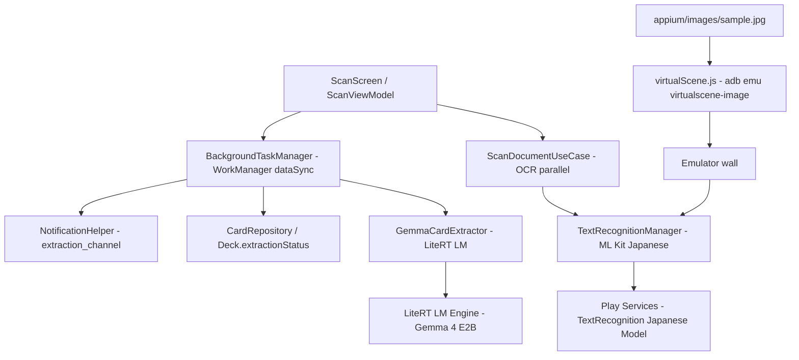

# Design Document — ScanCard OCR Pipeline (ML Kit + Gemma)

## Overview

OCR/word generation is separated from `app-core`: ML Kit (unbundled, Japanese) owns OCR, and Gemma (LiteRT LM) owns text-to-word generation only. The pipeline is executed as `ScanDocumentUseCase` (OCR, parallel) followed by `ExtractCardsUseCase`/`BackgroundTaskManager` (WorkManager `dataSync`). `appium/images/sample.jpg` is verified via Virtual Scene E2E.

## Architecture



### Technology Stack

| Layer | Technology | Purpose |
|-------|------------|---------|
| OCR | `play-services-mlkit-text-recognition:19.0.1` + `text-recognition-japanese:16.0.1` | Unbundled Japanese OCR (vertical/horizontal) |
| Word Gen | `litertlm-android:0.16.1` + `ai-delivery` | Gemma text→words only |
| Orchestration | `ScanDocumentUseCase` + `ExtractCardsUseCase`/`BackgroundTaskManager` (Hilt) | OCR (parallel, order-preserved) → Word→Persistence via WorkManager |
| Background | WorkManager `dataSync` | Same as app-core Req12, reuse NotificationHelper |
| E2E | `virtualScene.js` + `mlkitOcrSample.e2e.js` | Sample image verification |

## Components and Interfaces

### TextRecognitionManager

```kotlin
class TextRecognitionManager {
    suspend fun recognizeText(imageUri: Uri): String
    suspend fun recognizeTextFromBitmap(bitmap: Bitmap): String
    // Vertical/horizontal Japanese + English in one call, unbundled
}
```

- Impl `TextRecognitionManager`: singleton client built via `JapaneseTextRecognizerOptions.Builder().build()`, executed on `withContext(Dispatchers.IO)` after `downscaleIfNeeded(1080)` then `InputImage.fromBitmap` → `client.process(image).await()`. Uri is downscaled at decode time via `loadBitmapScaled(1080)`; Bitmap is downscaled directly. If the model is not yet cached, `ModuleInstall` `requestInstall` is tried once.

### GemmaCardExtractor (Word Generation)

```kotlin
class GemmaCardExtractor {
    suspend fun initialize(modelPath: String)
    suspend fun extractCards(prompt: String): List<ExtractedCard>
    fun close()
}
```

- Impl `GemmaCardExtractor` takes a text-only prompt (no image bytes). Blank input never reaches it: `ExtractCardsUseCase` skips blank pages while still advancing progress, and a blank deck returns `COMPLETED` with no model init. Output is parsed by `CardResponseParser` with 3 fallback strategies; single prompt per page with JSON format example (no retry).

### Pipeline Orchestration

- `ScanDocumentUseCase.processScannedPages(deckId, uris)` runs OCR for all pages in parallel via `coroutineScope { uris.map { async { ocr.recognizeText } }.awaitAll() }`, preserving page order, then inserts `Scan` rows.
- `ExtractCardsUseCase.extractAndSaveCards(deckId, modelConfig, onProgress)` (invoked via `BackgroundTaskManager.startExtraction` / `CardExtractionWorker`) processes scans page-by-page with a single prompt per page, parses via `CardResponseParser`, dedupes via `CardValidator`, inserts `Card` rows, and updates `Deck.extractionStatus` to `COMPLETED`. Blank pages skip the LLM while still advancing progress; a blank deck completes with no model init. Progress is posted via WorkManager `setProgress` and `NotificationHelper` (`deckId+100_000`).

## Data Models

```kotlin
data class ExtractedCard(val term: String, val definition: String, val japaneseTranslation: String, val confidence: Float = 1f)
```

`Deck.extractionStatus` reuses the existing `NONE→RUNNING→COMPLETED/FAILED` (Room). OCR success with zero words is also `COMPLETED` (empty deck is allowed).

## Correctness Properties

- OCR returns non-empty text for `sample.jpg` (including vertical writing).
- WordGen generates from OCR text only, without referencing the image.
- If OCR is empty, LLM is not called.

## Error Handling

- `MlKitModelNotReadyException`: retry `ModuleInstall.requestInstall` once, then surface `MlKitModelNotReadyException` only if download fails after one retry.
- `InputImage` failure: log and treat as `""` for the next page.
- LLM failure: `CardResponseParser` returns `emptyList()` when all 3 strategies fail; the page is skipped.
- WorkManager: `CancellationException` is rethrown for rescheduling.

## Testing Strategy

- Unit: `ScanDocumentUseCaseTest` (parallel, order-preserved, mocked OCR), `CardResponseParserTest` (3 fallback strategies), `ExtractCardsUseCaseTest` (blank deck/page skip without LLM).
- E2E: `mlkitOcrSample.e2e.js` injects `sample.jpg` via Virtual Scene → asserts non-empty `recognizeText` + (if model Ready) ≥1 card. Asserts `Idle` still passes OCR non-empty to prove isolation. `@slow` only when Gemma is invoked.
- Manual: verify initial Play Services model download wait time.

## Dependencies

| Dependency | Version | Purpose |
|------------|---------|---------|
| play-services-mlkit-text-recognition | 19.0.1 | Unbundled base |
| text-recognition-japanese | 16.0.1 | Japanese vertical/horizontal |
| kotlinx-coroutines-play-services | 1.11.0 | `await()` |
| play-services-base / module-install | latest | Model on-demand |
| litertlm-android | 0.16.1 | Gemma word gen |
| ai-delivery | 0.2.0-beta01 | Gemma model |
