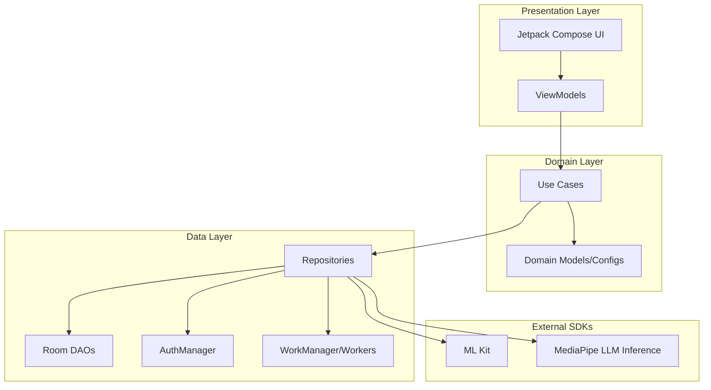

# ScanCard - Design Document

## Overview

ScanCard is an Android application that enables users to photograph book pages using the device camera, perform automatic document correction, and extract flashcard term/definition pairs using on-device LLMs (Gemma 4 family).

### System Characteristics

| Characteristic | Description |
|---------------|-------------|
| **Platform** | Android (OS 8.0 / API Level 26+) |
| **Language** | Kotlin 2.2+ |
| **UI Framework** | Jetpack Compose with Material 3 |
| **Architecture** | MVVM + Clean Architecture |
| **DI Framework** | Hilt |

### Key Capabilities

1. **Batch Scanning**: ML Kit Document Scanner integration.
2. **On-Device OCR**: ML Kit Text Recognition (Japanese/English).
3. **Multi-Model AI**: Support for Gemma 4 (E2B, E4B) and Gemma 2.
4. **OAuth Download**: Secure gated model download from Hugging Face.
5. **3D Study**: Interactive flashcard study with animations.
6. **Local Persistence**: Room database for decks, cards, and scans.

---

## Architecture

### High-Level Architecture Diagram



### Technology Stack

| Layer | Technology | Purpose |
|-------|------------|---------|
| UI | Jetpack Compose + Material 3 | Declarative UI, 3D animations |
| Architecture | MVVM + Clean Architecture | Separation of concerns |
| DI | Hilt | Dependency injection |
| Database | Room Database | Local data persistence |
| Auth | AppAuth-Android | Hugging Face OAuth 2.0 |
| Background | WorkManager | Reliable model downloads |
| Network | OkHttp | Secure authenticated downloads |
| OCR | ML Kit Text Recognition v2 | Japanese/English extraction |
| AI | MediaPipe LLM Inference | Gemma model execution |

---

## Core Components

### 1. AI & Model Management
- **ModelManager**: Manages model state, installation checks, and triggers background downloads via `WorkManager`.
- **ModelDownloadWorker**: `CoroutineWorker` that performs authenticated downloads using OkHttp and emits progress.
- **GemmaCardExtractor**: Wraps MediaPipe LLM Inference API, handles model initialization and inference.
- **CardResponseParser**: Multi-strategy parser (JSON, Regex, Text-Search) for AI output.

### 2. Authentication
- **AuthManager**: Handles OAuth 2.0 flow with Hugging Face, manages `AuthState` and provides tokens for gated model access.

### 3. Data Persistence (Room)
- **AppDatabase**: Main entry point for Room.
- **Entities**: `Deck` (id, title, timestamps), `Card` (term, definition, learned status), `Scan` (raw OCR text, image path).
- **DAOs**: Reactive `Flow`-based access to data.

---

## Data Models

### Model Configuration (`ModelConfig`)

```kotlin
data class ModelConfig(
    val id: String,
    val name: String,
    val description: String,
    val sizeGb: Double,
    val fileName: String,
    val downloadUrl: String
)
```

### AI States (`ModelState`)

```kotlin
sealed class ModelState {
    object Idle : ModelState()
    data class Downloading(val progress: Float) : ModelState()
    object Ready : ModelState()
    data class Error(val message: String) : ModelState()
}
```

---

## UI Layer Design

### Screen Structure
1. **Home Screen**: Deck list and management.
2. **Scan Screen**: Multi-page document capture.
3. **Extraction Preview**: Model selection, OAuth login, download progress, and AI trigger.
4. **Deck Detail**: Review extracted cards and start study.
5. **Study Screen**: 3D flip card interaction.
6. **Export Screen**: TSV/CSV format selection and sharing.

### Navigation Flow
- `Home` -> `Scan` -> `ExtractionPreview` -> `DeckDetail` -> `Study`/`Export`

---

## Implementation Rationale

- **Gemma 4 (E-series)**: Chosen for mobile optimization. E2B offers high speed, while E4B provides better reasoning for complex text.
- **OAuth + WorkManager**: Ensures that large gated model files are downloaded securely and reliably, even if the app is in the background.
- **Clean Architecture**: Separates AI/OCR implementation details from the core business logic of managing flashcards.
- **Offline-First**: All user content (text, images, flashcards) never leaves the device, ensuring maximum privacy.
