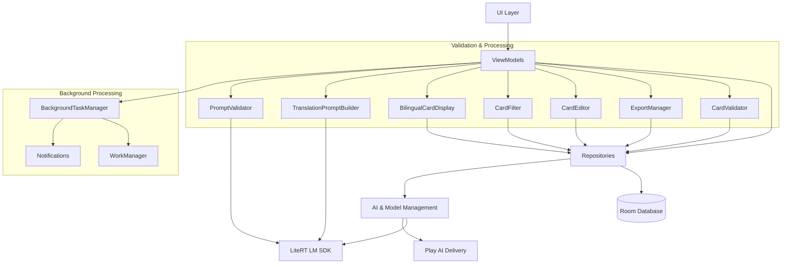

# ScanCard - Design Document

## Overview

ScanCard is an Android application that enables users to photograph book pages using the device camera, perform automatic document correction, and extract flashcard term/definition pairs using on-device LLMs (Gemma 4 family) via the **LiteRT LM SDK**.

### Key Capabilities

1. **Batch Scanning**: ML Kit Document Scanner integration.
2. **On-Device OCR**: ML Kit Text Recognition (Japanese/English).
3. **Multi-Model AI**: Support for Gemma 4 (E2B, E4B) via LiteRT LM.
4. **Google Play AI Delivery**: Models are delivered on-demand as **AI Packs**, avoiding third-party authentication.
5. **3D Study**: Interactive flashcard study with animations.
6. **Local Persistence**: Room database for decks, cards, and scans.
7. **Duplicate Prevention**: Automatic duplicate card detection with user warnings.
8. **Simplified Export**: TSV clipboard export without Quizlet labels.
9. **Card Editing**: Full CRUD operations for card management.
10. **Study Filtering**: Filter cards by learning status (NEW, LEARNING, REVIEW).
11. **Bilingual Display**: Toggle between English and Japanese on card back.
12. **Background Processing**: Long-running extraction with system notifications.

---

## Architecture

### Technology Stack

| Layer | Technology | Purpose |
|-------|------------|---------|
| UI | Jetpack Compose + Material 3 | Declarative UI, 3D animations |
| DI | Hilt | Dependency injection |
| Database | Room Database | Local data persistence |
| Delivery | **Google Play AI Delivery** | Secure on-demand model distribution |
| OCR | ML Kit Text Recognition v2 | Japanese/English extraction |
| AI | **LiteRT LM SDK** | Gemma 4 model orchestration (Engine/Conversation) |
| Background | WorkManager | Long-running task management |

### Component Diagram



---

## Components and Interfaces

### IModelManager

**Purpose**: Manages AI model lifecycle and download states via Google Play AI Delivery.

```kotlin
interface IModelManager {
    suspend fun getModelState(aiPackName: String): ModelState
    suspend fun downloadModel(aiPackName: String): Flow<DownloadProgress>
    suspend fun deleteModel(aiPackName: String): Boolean
}

enum class ModelState {
    NOT_DOWNLOADED,
    PENDING,
    DOWNLOADING,
    COMPLETED,
    FAILED
}

data class DownloadProgress(
    val bytesDownloaded: Long,
    val totalBytes: Long,
    val percentage: Int
)
```

### IGemmaCardExtractor

**Purpose**: Wraps LiteRT LM SDK for card extraction from OCR text.

```kotlin
interface IGemmaCardExtractor {
    suspend fun initialize(config: ModelConfig): Boolean
    suspend fun extractCards(prompt: String): List<ExtractedCard>
    suspend fun isModelReady(): Boolean
    fun release()
}

data class ExtractedCard(
    val term: String,
    val definition: String,
    val confidence: Float
)
```

### ITranslationPromptBuilder

**Purpose**: Constructs prompts for AI translation with term enforcement.

```kotlin
interface ITranslationPromptBuilder {
    fun buildPrompt(ocrText: String): String
    fun buildImprovedPrompt(ocrText: String, failedTerm: String): String
}
```

### IPromptValidator

**Purpose**: Validates AI-generated translations for quality.

```kotlin
interface IPromptValidator {
    fun validate(term: String, definition: String): ValidationResult
}

sealed class ValidationResult {
    data class Valid(val reason: String? = null) : ValidationResult()
    data class Invalid(val reason: String) : ValidationResult()
}
```

### ICardValidator

**Purpose**: Validates cards and detects duplicates.

```kotlin
interface ICardValidator {
    suspend fun checkDuplicate(deckId: Long, term: String): DuplicateWarning?
    fun validateCard(card: Card): CardValidationResult
}

sealed class CardValidationResult {
    data object Valid : CardValidationResult()
    data class Invalid(val reasons: List<String>) : CardValidationResult()
}
```

### ICardRepository

**Purpose**: Data access layer for flashcard persistence.

```kotlin
interface ICardRepository {
    suspend fun getCardsByDeck(deckId: Long): List<Card>
    suspend fun getCardById(id: Long): Card?
    suspend fun insert(card: Card): Long
    suspend fun insertAll(cards: List<Card>)
    suspend fun update(card: Card)
    suspend fun delete(card: Card)
    suspend fun deleteByDeck(deckId: Long)
}
```

### IExportManager

**Purpose**: Handles card export to various formats.

```kotlin
interface IExportManager {
    fun exportToTSV(cards: List<Card>): String
    fun exportToQuizletFormat(cards: List<Card>): String
}
```

### IBackgroundTaskManager

**Purpose**: Manages long-running background extraction tasks.

```kotlin
interface IBackgroundTaskManager {
    fun enqueueExtraction(ocrText: String, deckId: Long): String
    fun getTaskStatus(taskId: String): Flow<TaskStatus>
    fun cancelTask(taskId: String)
    fun getPendingTasks(): List<BackgroundTask>
}
```

### ICardFilter

**Purpose**: Filters cards by learning status.

```kotlin
interface ICardFilter {
    fun filter(cards: List<Card>, filterType: FilterType): List<Card>
}
```

### IBilingualCardDisplay

**Purpose**: Manages language preference for card display.

```kotlin
interface IBilingualCardDisplay {
    fun getLanguagePreference(): LanguagePreference
    fun toggleLanguage(): LanguagePreference
    fun setLanguage(preference: LanguagePreference)
}

enum class LanguagePreference {
    ENGLISH,
    JAPANESE
}
```

---

## Core Components

### 1. AI & Model Management
- **ModelManager**: Interfaces with `AiPackManager` to track AI Pack states (`PENDING`, `DOWNLOADING`, `COMPLETED`) and trigger downloads.
- **GemmaCardExtractor**: Wraps LiteRT LM Engine and Conversation APIs, handles model initialization and asynchronous inference using the downloaded pack assets.
- **TranslationPromptBuilder**: Constructs prompts for E2B translation, includes explicit instructions to use exact term in definition.
- **PromptValidator**: Validates that generated definitions contain the original term and are not generic responses.

### 2. Card Management
- **CardValidator**: Checks for duplicate terms in the same deck before card insertion.
- **CardEditor**: Provides edit, add, and delete operations for cards.
- **CardFilter**: Filters study cards by learning status (NEW, LEARNING, REVIEW, ALL).
- **BilingualCardDisplay**: Manages language toggle state (English/Japanese) for card back display.

### 3. Export
- **ExportManager**: Generates TSV format (Term[TAB]Definition) for clipboard export without Quizlet labels.

### 4. Background Processing
- **BackgroundTaskManager**: Manages long-running card extraction tasks using WorkManager with foreground service (`SystemForegroundService` declared `foregroundServiceType="dataSync"` for targetSDK 35, `ForegroundInfo` id = deckId, `setForeground()` at start of `doWork()`), handles progress reporting, notifications, and task resumption on app restart. Notification channel `extraction_channel` is used for both foreground progress and completion. `CardExtractionWorker.getForegroundInfo()` returns `ForegroundInfo(deckId, notification, DATA_SYNC)` on `UPSIDE_DOWN_CAKE+`, plain `ForegroundInfo(deckId, notification)` otherwise; manifest declares `<service android:name="androidx.work.impl.foreground.SystemForegroundService" android:foregroundServiceType="dataSync" tools:node="merge"/>` to satisfy `InvalidForegroundServiceTypeException` fixes (both `0x800 not subset 0x0` and `type none prohibited`). `dataSync` replaces the earlier `shortService` because `shortService` enforces a hard ~3-minute cap that killed real multi-minute LLM extraction mid-run (cards never reached `insertCards`, so reopening the app re-ran extraction against an empty deck).
- **Durable extraction state (Room)**: `Deck.extractionStatus: ExtractionStatus` (`NONE, PENDING, RUNNING, COMPLETED, FAILED`, stored as String via Room TypeConverter) is the single source of truth for "was this deck extracted and saved". Transitions: PENDING at enqueue (`BackgroundTaskManager.startExtraction`), RUNNING at `doWork()` start, COMPLETED in `ExtractCardsUseCase.extractAndSaveCards` immediately after `cardRepository.insertCards` (before `Result.success()`), FAILED on permanent worker failure. WorkManager state alone is insufficient: terminal CANCELLED/FAILED runs are never auto-retried, so a swallowed `CancellationException → Result.failure()` permanently blocked resume.
- **Enqueue policy**: `ExistingWorkPolicy.APPEND_OR_REPLACE` + `BackoffPolicy.EXPONENTIAL 10s`. APPEND_OR_REPLACE appends to an ENQUEUED/RUNNING chain (no cancel of live work — the earlier REPLACE caused "Job was cancelled" notification spam) and replaces CANCELLED/FAILED chains so retries are never silently dropped. The pre-enqueue RUNNING/ENQUEUED skip check uses the Flow API (`getWorkInfosForUniqueWorkFlow().first()`) instead of blocking `.get()`.
- **Cancellation semantics**: `CardExtractionWorker.doWork()` rethrows `CancellationException` (does NOT convert to `Result.failure()`) so WorkManager keeps its own stop/resume semantics: system-initiated stops (timeout, process death) reschedule the work automatically. Generic failures return `Result.retry()` up to `runAttemptCount < 3` with backoff, then mark the deck FAILED and emit one error notification.
- **Resume-on-launch**: `ScanCardApplication.onCreate` launches `ResumePendingExtractionsUseCase` on an application-scope coroutine. It queries `DeckDao.getStuckExtractionDecks()` (`extractionStatus IN ('PENDING','RUNNING')`) and re-enqueues only decks with no non-terminal WorkManager work (checked per unique name), reconciling DB state with actual scheduler state without double-running auto-resumed jobs.
- **Progress notification**: `ExtractCardsUseCase.extractAndSaveCards(deckId, modelConfig, onProgress)` processes scans **page-by-page** (one prompt/LLM call per scan instead of one combined-text call) and invokes `onProgress(current, total)` with `(0, N)` before the first page and `(i, N)` after page i completes (`N = scans.size`). The worker's `onProgress` lambda calls `NotificationHelper.showProgressNotification(deckId, current, total)` — an ongoing notification built with `setProgress(total, current, false)`, `setOnlyAlertOnce(true)`, posted via `NotificationManager.notify(deckId + 100_000, …)`. **The app-managed id MUST differ from the FGS notification id**: WorkManager's `SystemFgDispatcher` re-posts the original foreground notification under `deckId` on every `setProgress()`/service event, silently overwriting any same-id custom text (verified on API 36 emulator: only `ONLY_ALERT_ONCE`-flagged raw posts survived). Completion/error notifications reuse `deckId + 100_000` so they replace the progress card. The worker also mirrors progress into WorkManager via `setProgress(workDataOf("progress_current" to c, "progress_total" to t))` for in-app observers. Retry loop (up to 3 improved-prompt attempts) is applied per page; accumulated pairs are deduped and inserted in a single `insertCards` at the end, preserving Req 12.8 ordering. E2E verifies visibility by physically opening the notification shade (`driver.openNotifications()`) and asserting `Page n of m` appears — dumpsys-based checks proved unreliable due to emulator clock skew between host and device.

### 5. Test-Only E2E Helpers (DEBUG only, not in release)
- **ScanScreen `scanDummyInsertBtn`**: `OutlinedButton` with `Modifier.testTag("scanDummyInsertBtn")`, visible only when `BuildConfig.DEBUG` is true (both empty and grid states, `app/src/main/java/com/plath/scancard/ui/scan/ScanScreen.kt:199,245`). Calls `ScanViewModel.insertDummyScanForE2E()` -> `ScanDocumentUseCase.insertDummyScan()` which inserts a dummy `Scan` with `rawText` Apple/Banana/Cat, bypassing ML Kit.
- **ExtractionPreviewScreen `createDummyModelBtn`**: Visible only in `Idle` state and `BuildConfig.DEBUG`, writes `files/gemma-4-E2B-it.litertlm` (<5MB dummy) and refreshes `ModelManager` to `Ready`.
- **GemmaCardExtractor dummy mode**: When `BuildConfig.DEBUG` and `modelFile.length() < 5MB`, `isDummyMode=true`, `extractCards()` delays 8s (long enough for E2E to open the notification shade and observe progress mid-run despite host/device clock skew) and returns 2 `ExtractedCard` without initializing LiteRT Engine, enabling `CardExtractionWorker` to complete on emulators without 2.6GB storage.
- **Permissions**: `FOREGROUND_SERVICE`, `FOREGROUND_SERVICE_SHORT_SERVICE`, `FOREGROUND_SERVICE_DATA_SYNC`, `POST_NOTIFICATIONS`; pre-granted via `pm grant` in Appium `helpers/utils.js` for `emulator-5554` (API 36).

---

## Data Models

### Model Configuration (`ModelConfig`)

```kotlin
data class ModelConfig(
    val id: String,
    val name: String,
    val description: String,
    val sizeGb: Double,
    val fileName: String,
    val aiPackName: String
)
```

### Flashcard with E2B Translation (`Card`)

```kotlin
data class Card(
    val id: Long = 0,
    val deckId: Long,
    val term: String,
    val definition: String,          // English definition
    val japaneseTranslation: String, // Japanese translation (E2B)
    val status: CardStatus = CardStatus.NEW,
    val createdAt: Long = System.currentTimeMillis(),
    val isDuplicate: Boolean = false,
    val duplicateOfId: Long? = null
)

enum class CardStatus {
    NEW,
    LEARNING,
    REVIEW
}
```

### Duplicate Warning (`DuplicateWarning`)

```kotlin
data class DuplicateWarning(
    val existingCard: Card,
    val newTerm: String,
    val suggestedAction: DuplicateAction = DuplicateAction.SHOW_WARNING
)

enum class DuplicateAction {
    SHOW_WARNING,
    AUTO_SKIP,
    AUTO_ADD_WITH_INDICATOR
}
```

### Background Task (`BackgroundTask`)

```kotlin
data class BackgroundTask(
    val id: String,
    val taskType: TaskType,
    val status: TaskStatus,
    val progress: Int = 0,          // 0-100 percentage
    val totalItems: Int = 0,
    val processedItems: Int = 0,
    val result: TaskResult? = null,
    val createdAt: Long = System.currentTimeMillis(),
    val completedAt: Long? = null
)

enum class TaskType {
    CARD_EXTRACTION,
    OCR_PROCESSING,
    MODEL_DOWNLOAD
}

enum class TaskStatus {
    PENDING,
    RUNNING,
    COMPLETED,
    FAILED,
    CANCELLED
}

sealed class TaskResult {
    data class Success(val cards: List<Card>) : TaskResult()
    data class Error(val message: String, val cause: Throwable? = null) : TaskResult()
}
```

### Card Filter Configuration (`FilterConfig`)

```kotlin
data class FilterConfig(
    val filterType: FilterType = FilterType.ALL,
    val persisted: Boolean = true
)

enum class FilterType {
    ALL,
    NEW,
    LEARNING,
    REVIEW
}
```

---

## Key Functions with Formal Specifications

### Function 1: checkDuplicate()

```kotlin
fun CardValidator.checkDuplicate(
    deckId: Long,
    term: String
): DuplicateWarning?
```

**Preconditions:**
- `deckId` is a valid positive integer
- `term` is non-null and non-empty string

**Postconditions:**
- Returns `null` if no duplicate exists
- Returns `DuplicateWarning` with existing card if duplicate found
- Does not modify any database records

**Loop Invariants:** N/A

---

### Function 2: exportToTSV()

```kotlin
fun ExportManager.exportToTSV(cards: List<Card>): String
```

**Preconditions:**
- `cards` is non-null list
- Each card has non-null term and definition

**Postconditions:**
- Returns string in format: "term1\tdefinition1\nterm2\tdefinition2\n"
- Does not include "(Quizlet)" or any format labels
- Returns empty string for empty card list

---

### Function 3: filterCards()

```kotlin
fun CardFilter.filterCards(
    cards: List<Card>,
    filterType: FilterType
): List<Card>
```

**Preconditions:**
- `cards` is non-null list
- `filterType` is valid enum value

**Postconditions:**
- Returns filtered list based on filterType
- ALL returns original list unchanged
- Other filters return cards matching the specified status

---

### Function 4: toggleLanguage()

```kotlin
fun BilingualCardDisplay.toggleLanguage(): LanguagePreference
```

**Preconditions:** None

**Postconditions:**
- Returns new language preference
- Toggles between ENGLISH and JAPANESE
- Persists preference for session continuity

---

### Function 5: validateTranslation()

```kotlin
fun PromptValidator.validateTranslation(
    term: String,
    definition: String
): ValidationResult
```

**Preconditions:**
- `term` is non-empty string
- `definition` is non-null

**Postconditions:**
- Returns ValidationResult.Valid if definition contains term or is not generic
- Returns ValidationResult.Invalid with reason if validation fails
- Generic responses like "A topic to Explore" are flagged as invalid

---

### Function 6: runBackgroundExtraction()

```kotlin
fun BackgroundTaskManager.runBackgroundExtraction(
    ocrText: String,
    deckId: Long
): WorkContinuation
```

**Preconditions:**
- `ocrText` is non-empty string
- `deckId` is valid positive integer

**Postconditions:**
- Returns WorkContinuation for the enqueued work
- Work runs independently of UI lifecycle
- Notification shown on completion

**Loop Invariants:**
- Progress updates are reported incrementally

---

## Algorithmic Pseudocode

### Main Card Extraction Algorithm

```pascal
ALGORITHM extractCardsFromScan
INPUT: ocrText: String, deckId: Long
OUTPUT: result: ExtractionResult

BEGIN
    // Step 1: Build translation prompt
    prompt ← TranslationPromptBuilder.buildPrompt(ocrText)
    
    // Step 2: Run AI extraction with retry logic
    maxRetries ← 3
    FOR attempt FROM 1 TO maxRetries DO
        rawResponse ← GemmaCardExtractor.extract(prompt)
        parsedCards ← Parser.parseResponse(rawResponse)
        
        // Step 3: Validate translations
        allValid ← TRUE
        FOR EACH card IN parsedCards DO
            validation ← PromptValidator.validateTranslation(card.term, card.definition)
            IF validation IS Invalid THEN
                allValid ← FALSE
                BREAK
            END IF
        END FOR
        
        IF allValid THEN
            BREAK
        END IF
        
        // Step 4: Retry with improved prompt if validation failed
        IF attempt < maxRetries THEN
            prompt ← TranslationPromptBuilder.buildImprovedPrompt(ocrText, card.term)
        END IF
    END FOR
    
    // Step 5: Check for duplicates and create cards
    finalCards ← EMPTY_LIST
    FOR EACH card IN parsedCards DO
        duplicate ← CardValidator.checkDuplicate(deckId, card.term)
        
        IF duplicate IS NOT NULL THEN
            userChoice ← UI.showDuplicateWarning(duplicate)
            IF userChoice IS KEEP THEN
                card.isDuplicate ← TRUE
                card.duplicateOfId ← duplicate.existingCard.id
            ELSE
                CONTINUE  // Skip duplicate
            END IF
        END IF
        
        finalCards.add(card)
    END FOR
    
    // Step 6: Persist to database
    CardRepository.insertAll(finalCards)
    
    RETURN Success(finalCards)
END
```

**Preconditions:**
- OCR text is available and well-formed
- AI model is ready (COMPLETED status)
- All required services are initialized

**Postconditions:**
- result contains list of created cards
- Duplicate warnings shown for any duplicate terms
- All valid cards persisted to database

**Loop Invariants:**
- Each card in parsedCards is validated before insertion
- Progress reported incrementally during processing

### Duplicate Detection Algorithm

```pascal
ALGORITHM checkDuplicate
INPUT: deckId: Long, term: String
OUTPUT: warning: DuplicateWarning or null

BEGIN
    // Normalize term for comparison (trim whitespace, lowercase)
    normalizedTerm ← normalizeString(term)
    
    // Query database for existing cards with same deck
    existingCards ← CardRepository.getCardsByDeck(deckId)
    
    FOR EACH card IN existingCards DO
        normalizedExisting ← normalizeString(card.term)
        
        IF normalizedTerm EQUALS normalizedExisting THEN
            // Check if definitions differ
            IF card.definition NOT_EQUALS getCurrentDefinition() THEN
                RETURN DuplicateWarning(
                    existingCard: card,
                    newTerm: term,
                    suggestedAction: SHOW_WARNING
                )
            ELSE
                RETURN DuplicateWarning(
                    existingCard: card,
                    newTerm: term,
                    suggestedAction: AUTO_SKIP
                )
            END IF
        END IF
    END FOR
    
    RETURN null  // No duplicate found
END
```

**Preconditions:**
- deckId is valid
- term is non-empty

**Postconditions:**
- Returns warning with existing card if duplicate found
- Returns null if no duplicate

### Card Filter Algorithm

```pascal
ALGORITHM filterCards
INPUT: cards: List<Card>, filterType: FilterType
OUTPUT: filteredCards: List<Card>

BEGIN
    IF filterType EQUALS ALL THEN
        RETURN cards
    END IF
    
    filteredCards ← EMPTY_LIST
    
    FOR EACH card IN cards DO
        IF card.status EQUALS filterType THEN
            filteredCards.add(card)
        END IF
    END FOR
    
    RETURN filteredCards
END
```

**Preconditions:**
- cards list is non-null
- filterType is valid enum

**Postconditions:**
- Returns all cards matching filter type
- Original list unchanged

### TSV Export Algorithm

```pascal
ALGORITHM exportToTSV
INPUT: cards: List<Card>
OUTPUT: tsvContent: String

BEGIN
    tsvContent ← EMPTY_STRING
    lines ← EMPTY_LIST
    
    FOR EACH card IN cards DO
        // Escape tab characters in content
        escapedTerm ← escapeSpecialChars(card.term, TAB)
        escapedDefinition ← escapeSpecialChars(card.definition, TAB)
        
        line ← escapedTerm + TAB + escapedDefinition
        lines.add(line)
    END FOR
    
    tsvContent ← join(lines, NEWLINE)
    
    RETURN tsvContent
END
```

**Preconditions:**
- cards is non-null

**Postconditions:**
- Returns TSV format string
- No Quizlet labels included

---

## Example Usage

### Example 1: Card Extraction with Background Processing

```kotlin
// Background extraction initiated from UI
val workRequest = OneTimeWorkRequestBuilder<CardExtractionWorker>()
    .setInputData(workDataOf(
        "ocr_text" to ocrText,
        "deck_id" to deckId
    ))
    .build()

WorkManager.enqueue(workRequest)

// Progress observed via LiveData
workManager.getWorkInfoByIdLiveData(workRequest.id).observe(this) { workInfo ->
    when (workInfo.state) {
        WorkInfo.State.RUNNING -> {
            val progress = workInfo.progress.getInt("progress", 0)
            progressBar.setProgress(progress)
        }
        WorkInfo.State.SUCCEEDED -> {
            NotificationHelper.showCompletionNotification()
        }
    }
}
```

### Example 2: Duplicate Card Handling

```kotlin
suspend fun handleCardExtraction(deckId: Long, ocrText: String) {
    val cards = gemmaExtractor.extractCards(ocrText)
    
    cards.forEach { card ->
        val duplicateWarning = cardValidator.checkDuplicate(deckId, card.term)
        
        if (duplicateWarning != null) {
            val userChoice = showDuplicateDialog(duplicateWarning)
            when (userChoice) {
                UserChoice.KEEP -> {
                    card.isDuplicate = true
                    card.duplicateOfId = duplicateWarning.existingCard.id
                    cardRepository.insert(card)
                }
                UserChoice.SKIP -> {
                    // Skip adding duplicate
                }
                UserChoice.VIEW_BOTH -> {
                    showComparisonView(duplicateWarning.existingCard, card)
                }
            }
        } else {
            cardRepository.insert(card)
        }
    }
}
```

### Example 3: Bilingual Card Display

```kotlin
@Composable
fun CardBackContent(card: Card) {
    var languagePreference by remember { mutableStateOf(LanguagePreference.ENGLISH) }
    
    Column {
        // Main definition display
        Text(
            text = if (languagePreference == LanguagePreference.ENGLISH) 
                card.definition 
            else 
                card.japaneseTranslation,
            style = MaterialTheme.typography.bodyLarge
        )
        
        // Language toggle
        Button(
            onClick = { 
                languagePreference = languagePreference.toggle() 
            }
        ) {
            Text(
                if (languagePreference == LanguagePreference.ENGLISH) 
                    "日本語に切り替え" 
                else 
                    "Switch to English"
            )
        }
    }
}
```

### Example 4: Study Screen Filtering

```kotlin
@Composable
fun StudyScreen(viewModel: StudyViewModel) {
    var selectedFilter by remember { mutableStateOf(FilterType.ALL) }
    
    // Persist filter selection
    LaunchedEffect(selectedFilter) {
        viewModel.saveFilterPreference(selectedFilter)
    }
    
    Column {
        // Filter dropdown
        FilterDropdown(
            selectedFilter = selectedFilter,
            onFilterChanged = { selectedFilter = it }
        )
        
        // Filtered cards
        val filteredCards = viewModel.filterCards(selectedFilter)
        LazyColumn(items = filteredCards) { card -> CardItem(card) }
    }
}
```

---

## Correctness Properties

### Property 1: Duplicate Detection

*For any* deck and any term text, when checking for duplicates, the system SHALL return a warning if and only if an existing card in the same deck has identical normalized term text.

**Validates: Requirements 6.1, 6.2**

### Property 2: TSV Export Format

*For any* list of cards, exporting to TSV and parsing the result SHALL produce term-definition pairs where each pair matches the original card's term and definition.

**Validates: Requirements 7.1, 7.2**

### Property 3: Filter Completeness

*For any* list of cards and any filter type, filtering by a specific status SHALL return only cards with that exact status, and filtering by ALL SHALL return the original list unchanged.

**Validates: Requirements 9.2, 9.3, 9.4, 9.5**

### Property 4: Bilingual Toggle Persistence

*For any* card with both English and Japanese translations, toggling the language preference SHALL immediately reflect the correct translation, and the preference SHALL remain stable until the next toggle.

**Validates: Requirements 10.1, 10.2, 10.3**

### Property 5: Translation Validation

*For any* term-definition pair generated by the AI, validation SHALL pass if and only if the definition contains the term (case-insensitive) AND the definition is not a generic response.

**Validates: Requirements 11.2, 11.3**

### Property 6: Background Task Completion

*For any* card extraction initiated as a background task, the task SHALL complete successfully and notify the user via system notification, regardless of whether the user navigates away from the extraction screen.

**Validates: Requirements 12.2, 12.3, 12.4**

---

## Error Handling

### Duplicate Detection Errors
- **Condition**: Database query fails during duplicate check
- **Response**: Log error, proceed with card insertion, skip duplicate check
- **Recovery**: User can manually review and delete duplicates later

### Export Errors
- **Condition**: Clipboard access fails
- **Response**: Show error toast, offer alternative export (save to file)
- **Recovery**: User can retry export operation

### Translation Validation Failures
- **Condition**: AI generates generic or invalid translation
- **Response**: Automatic retry with improved prompt (up to 3 attempts)
- **Recovery**: If all retries fail, mark card for manual review

### Background Task Failures
- **Condition**: App terminated during extraction
- **Response**: WorkManager automatically resumes task on app restart
- **Recovery**: User notified of completion/failure via notification

---

## Testing Strategy

### Unit Testing Approach

The application will use **JUnit 5** and **MockK** for unit testing of core business logic. Key test areas include:

1. **CardValidator**: Test duplicate detection with various term normalizations (trimming, case-insensitivity)
2. **CardFilter**: Test filtering logic for all FilterType values (ALL, NEW, LEARNING, REVIEW)
3. **ExportManager**: Verify TSV format output and special character escaping
4. **TranslationPromptBuilder**: Validate prompt construction includes required instructions
5. **PromptValidator**: Test validation logic for generic responses and term presence checks

**Coverage Goals**: Minimum 80% coverage for business logic in core components.

### Property-Based Testing Approach

Property-based testing will be implemented using **Kotest** with **Arrow** for property-based testing, validating universal properties across randomly generated inputs:

1. **Duplicate Detection Property**: For any two terms, normalization should produce identical results for identical terms and different results for different terms
2. **TSV Round-Trip Property**: For any list of cards, parsing exported TSV should reconstruct original term-definition pairs
3. **Filter Completeness Property**: For any card list and filter type, filtering should not lose or duplicate cards

**Property Test Library**: Kotest with property-checking extensions

**Test Iterations**: 100 iterations per property

### Integration Testing Approach

Integration tests will verify end-to-end flows using **HiltTestApplication** and in-memory Room database:

1. **Card Extraction Flow**: Full flow from OCR text through AI extraction, validation, duplicate check, and database persistence
2. **Background Task Flow**: Verify WorkManager integration, progress reporting, and notification handling
3. **Export Flow**: Test export to clipboard and verify pasted content

### UI Testing

**Compose UI Testing** with **ComposeTestRule**:
- Test card display with bilingual toggle
- Verify filter dropdown behavior
- Test duplicate warning dialog interactions
- Verify study screen card navigation

---

## Dependencies

| Dependency | Version | Purpose |
|------------|---------|---------|
| Jetpack Compose BOM | 2024.02.00 | UI Framework |
| Hilt | 2.50 | Dependency Injection |
| Room | 2.6.1 | Local Database |
| WorkManager | 2.9.0 | Background Processing |
| ML Kit Document Scanner | 16.0.0-beta1 | Document Scanning |
| ML Kit Text Recognition | 16.0.0 | OCR |
| LiteRT LM SDK | Latest | On-device LLM |
| Google Play AI Delivery | Latest | Model Distribution |
