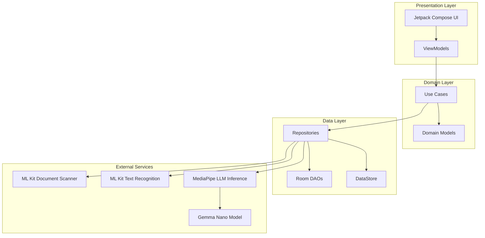
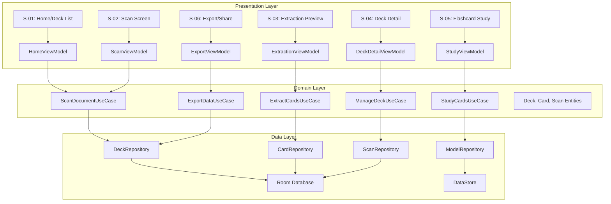
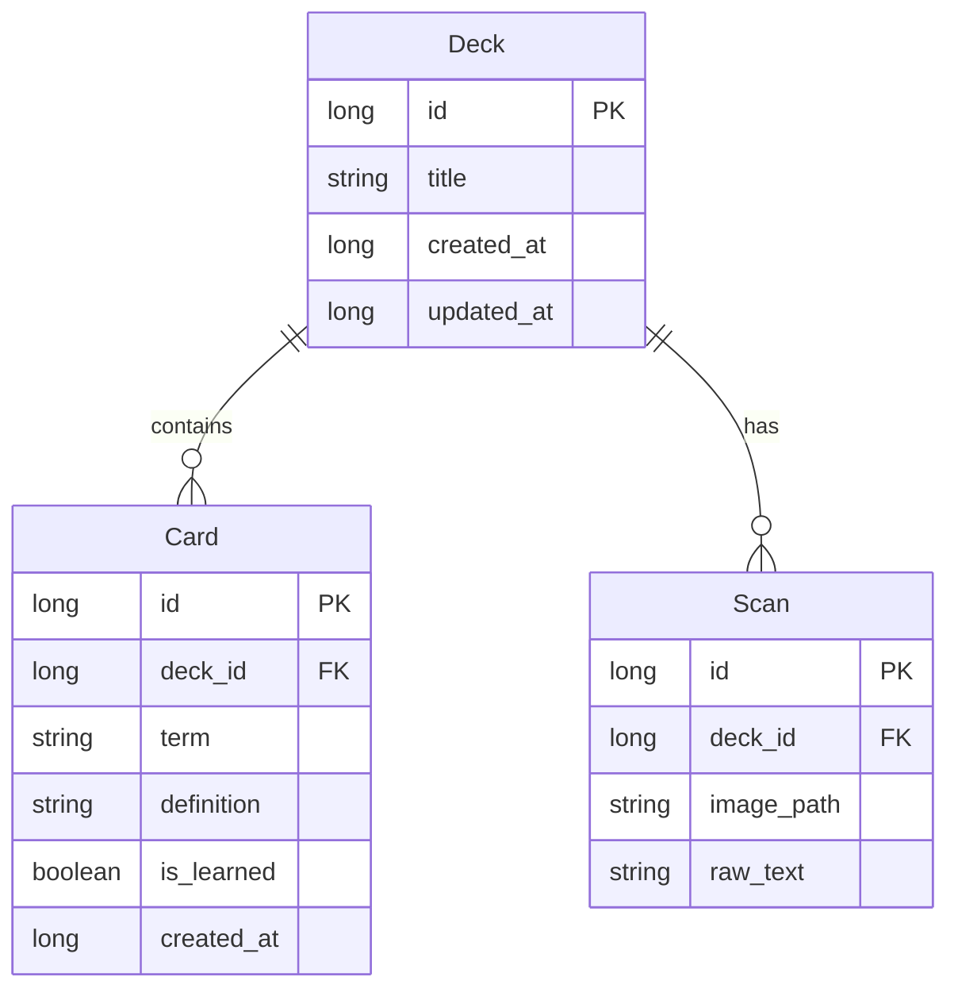
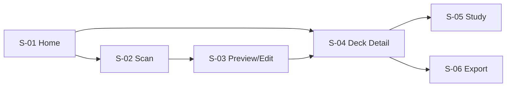

# ScanCard - Design Document

## Overview

ScanCard is an Android application that enables users to photograph book pages using the device camera, perform automatic document curvature correction, generate searchable PDF exports, and extract flashcard term/definition pairs using on-device LLM (Gemma Nano) - all in fully offline mode.

### System Characteristics

| Characteristic | Description |
|---------------|-------------|
| **Platform** | Android (OS 10.0 / API Level 29+) |
| **Language** | Kotlin |
| **UI Framework** | Jetpack Compose with Material 3 |
| **Architecture** | MVVM + Clean Architecture |
| **DI Framework** | Hilt |
| **Target Users** | Students, researchers, and book readers who want to digitize content and create flashcards |

### Key Capabilities

1. **Batch Document Scanning**: Capture multiple pages using ML Kit Document Scanner with automatic document detection
2. **Automatic Image Correction**: Perspective correction, shadow removal, and brightness normalization
3. **On-Device OCR**: Text recognition using ML Kit Text Recognition v2 (supports Japanese and English)
4. **AI-Powered Flashcard Extraction**: Extract term/definition pairs using Gemma Nano via MediaPipe LLM Inference
5. **Deck Management**: Organize flashcards into decks by book title or chapter
6. **3D Flip Flashcard Learning**: Interactive study experience with flip animations
7. **Export Options**: Quizlet-compatible TSV/CSV export and searchable PDF generation
8. **Privacy-First**: Fully offline operation with no external data transmission

---

## Architecture

### High-Level Architecture Diagram



### Clean Architecture Layers



### Technology Stack

| Layer | Technology | Purpose |
|-------|------------|---------|
| UI | Jetpack Compose + Material 3 | Declarative UI, animations |
| Architecture | MVVM + Clean Architecture | Separation of concerns |
| DI | Hilt | Dependency injection |
| Database | Room Database | Local data persistence |
| Preferences | DataStore | Model state, preferences |
| Scanning | ML Kit Document Scanner | Batch document capture |
| OCR | ML Kit Text Recognition v2 | On-device text extraction |
| AI | MediaPipe LLM Inference | Gemma Nano model execution |
| Async | Kotlin Coroutines + Flow | Background processing |

---

## Components and Interfaces

### Core Components

#### 1. Scanning Components

| Component | Responsibility | Public API |
|-----------|---------------|------------|
| `DocumentScanner` | Orchestrates ML Kit Document Scanner | `launchScanner(): Flow<List<Uri>>` |
| `ImageProcessor` | Applies corrections to captured images | `processImage(uri: Uri): ProcessedImage` |
| `ImageStorage` | Manages image file persistence | `saveImage(bytes: ByteArray): String` |

#### 2. OCR Components

| Component | Responsibility | Public API |
|-----------|---------------|------------|
| `TextRecognizer` | Wraps ML Kit Text Recognition | `recognize(image: Bitmap): String` |
| `OcrProcessor` | Manages OCR workflow | `processAsync(uri: Uri): Flow<OcrResult>` |

#### 3. AI Components

| Component | Responsibility | Public API |
|-----------|---------------|------------|
| `ModelManager` | Downloads and caches Gemma Nano | `ensureModel(): Flow<ModelState>` |
| `GemmaExtractor` | Extracts flashcards via LLM | `extractCards(text: String): List<CardPair>` |
| `ResponseParser` | Parses JSON from LLM with fallbacks | `parse(response: String): List<CardPair>` |

#### 4. Data Components

| Component | Responsibility | Public API |
|-----------|---------------|------------|
| `DeckRepository` | CRUD operations for decks | `getAll(), create(), update(), delete()` |
| `CardRepository` | CRUD operations for cards | `getByDeck(), create(), update(), delete()` |
| `ScanRepository` | CRUD operations for scans | `getByDeck(), create(), delete()` |

#### 5. Export Components

| Component | Responsibility | Public API |
|-----------|---------------|------------|
| `QuizletExporter` | Generates TSV/CSV exports | `exportToTsv(cards), exportToCsv(cards)` |
| `PdfGenerator` | Creates searchable PDFs | `generate(scanSession): File` |
| `ShareManager` | Handles Android share intents | `shareFile(file, mimeType)` |

---

## Data Models

### Database Schema



### Room Entities

#### Deck Entity

```kotlin
@Entity(tableName = "decks")
data class Deck(
    @PrimaryKey(autoGenerate = true)
    val id: Long = 0,
    val title: String,
    val createdAt: Long = System.currentTimeMillis(),
    val updatedAt: Long = System.currentTimeMillis()
)
```

#### Card Entity

```kotlin
@Entity(
    tableName = "cards",
    foreignKeys = [
        ForeignKey(
            entity = Deck::class,
            parentColumns = ["id"],
            childColumns = ["deckId"],
            onDelete = ForeignKey.CASCADE
        )
    ]
)
data class Card(
    @PrimaryKey(autoGenerate = true)
    val id: Long = 0,
    val deckId: Long,
    val term: String,
    val definition: String,
    val isLearned: Boolean = false,
    val createdAt: Long = System.currentTimeMillis()
)
```

#### Scan Entity

```kotlin
@Entity(
    tableName = "scans",
    foreignKeys = [
        ForeignKey(
            entity = Deck::class,
            parentColumns = ["id"],
            childColumns = ["deckId"],
            onDelete = ForeignKey.CASCADE
        )
    ]
)
data class Scan(
    @PrimaryKey(autoGenerate = true)
    val id: Long = 0,
    val deckId: Long,
    val imagePath: String,
    val rawText: String
)
```

### Data Classes

#### ProcessedImage

```kotlin
data class ProcessedImage(
    val originalUri: Uri,
    val correctedBitmap: Bitmap,
    val correctedPath: String,
    val confidence: Float
)
```

#### OcrResult

```kotlin
data class OcrResult(
    val scanId: Long,
    val rawText: String,
    val charCount: Int,
    val isLowConfidence: Boolean
)
```

#### CardPair

```kotlin
data class CardPair(
    val term: String,
    val definition: String
)
```

#### ModelState

```kotlin
sealed class ModelState {
    data object NotDownloaded : ModelState()
    data class Downloading(val progress: Int) : ModelState()
    data object Ready : ModelState()
    data class Error(val message: String) : ModelState()
}
```

---

## API Integration Design

### ML Kit Document Scanner Integration

The ML Kit Document Scanner provides a pre-built UI for multi-page document scanning.

```kotlin
class DocumentScannerLauncher {
    private val scanner = DocumentScannerOptions.Builder()
        .setMode(DocumentScannerOptions.SCANNER_MODE_FULL)
        .setPageLimit(100) // Max batch size per Req 1.6
        .setResultFormat(DocumentScannerOptions.RESULT_FORMAT_JPEG)
        .build()

    fun getLauncher(): ActivityResultLauncher<DocumentScannerOptions> {
        return registerForActivityResult(
            DocumentScannerContract(scanner)
        ) { result ->
            // Handle scanned pages
            // Trigger image correction pipeline
        }
    }
}
```

**Flow:**
1. User taps scan button → Launch ML Kit Document Scanner
2. ML Kit handles camera, document detection, and page capture
3. Return list of captured image URIs
4. Process images through correction pipeline

### ML Kit Text Recognition Integration

```kotlin
class TextRecognizerManager {
    private val recognizer = TextRecognition.getClient(
        TextRecognizerOptions.DEFAULT_OPTIONS
    )

    suspend fun recognize(image: Bitmap): String = suspendCoroutine { cont ->
        val inputImage = InputImage.fromBitmap(image, 0)
        recognizer.process(inputImage)
            .addOnSuccessListener { visionText ->
                cont.resumeWith(Result.success(visionText.text))
            }
            .addOnFailureListener { e ->
                cont.resumeWith(Result.failure(e))
            }
    }
}
```

### MediaPipe LLM Inference Integration

```kotlin
class GemmaCardExtractor @Inject constructor(
    private val context: Context
) {
    private var llmInference: LlmInference? = null

    fun initializeModel(modelPath: String) {
        val options = LlmInference.LlmInferenceOptions.builder()
            .setModelPath(modelPath)
            .setMaxTokens(512)
            .setTemperature(0.2f)
            .setTopK(40)
            .setTopP(0.95f)
            .build()
        
        llmInference = LlmInference.createFromOptions(context, options)
    }

    suspend fun extractCards(ocrText: String): String = withContext(Dispatchers.IO) {
        val prompt = buildPrompt(ocrText)
        llmInference?.generateResponse(prompt) 
            ?: throw IllegalStateException("Model not initialized")
    }

    private fun buildPrompt(text: String): String = """
        You are an expert flashcard generator.
        Extract important key terms and their definitions from the text below.
        
        Output MUST be a raw JSON array of objects with "term" and "definition" keys.
        Do not output markdown code blocks. Do not add introductory text.
        
        Text:
        $text
    """.trimIndent()
}
```

### Model Download and Caching

```kotlin
class ModelManager @Inject constructor(
    private val context: Context,
    private val dataStore: DataStore<Preferences>
) {
    private val modelDir = File(context.filesDir, "models")
    
    suspend fun ensureModel(): Flow<ModelState> = flow {
        emit(ModelState.Downloading(0))
        
        val modelFile = File(modelDir, MODEL_FILE_NAME)
        
        if (modelFile.exists()) {
            emit(ModelState.Ready)
            return@flow
        }
        
        // Download from bundled asset or remote
        try {
            downloadModel(modelFile) { progress ->
                // Emit progress updates
            }
            dataStore.edit { it[MODEL_CACHED_KEY] = true }
            emit(ModelState.Ready)
        } catch (e: Exception) {
            emit(ModelState.Error(e.message ?: "Download failed"))
        }
    }
}
```

---

## UI Layer Design

### Screen Structure



### Screen Specifications

#### S-01: Home Screen (Deck List)

| Element | Description |
|---------|-------------|
| **App Bar** | Title "ScanCard", optional settings icon |
| **Empty State** | Illustration + "Create your first deck" message |
| **Deck List** | LazyColumn with DeckItem cards |
| **Deck Card** | Title, card count, last updated date |
| **FAB** | Camera icon to start new scan |

**ViewModel: HomeViewModel**
```kotlin
data class HomeUiState(
    val decks: List<Deck> = emptyList(),
    val isLoading: Boolean = false,
    val error: String? = null
)

@HiltViewModel
class HomeViewModel @Inject constructor(
    private val deckRepository: DeckRepository
) : ViewModel() {
    
    private val _uiState = MutableStateFlow(HomeUiState())
    val uiState: StateFlow<HomeUiState> = _uiState.asStateFlow()
    
    init {
        loadDecks()
    }
    
    private fun loadDecks() {
        viewModelScope.launch {
            deckRepository.getAllDecksSorted()
                .collect { decks ->
                    _uiState.update { it.copy(decks = decks, isLoading = false) }
                }
        }
    }
}
```

#### S-02: Scan Screen

| Element | Description |
|---------|-------------|
| **ML Kit Scanner** | Full-screen document scanner UI |
| **Progress Indicator** | Shows during batch processing |
| **Thumbnail Preview** | Grid of captured page thumbnails |

**ViewModel: ScanViewModel**
```kotlin
data class ScanUiState(
    val capturedPages: List<Uri> = emptyList(),
    val processedPages: List<ProcessedImage> = emptyList(),
    val isProcessing: Boolean = false,
    val error: ScanError? = null
)

sealed class ScanError {
    data object ProcessingFailed : ScanError()
    data object ImageCorrectionFailed : ScanError()
}
```

#### S-03: Extraction Result Preview & Editing

| Element | Description |
|---------|-------------|
| **Card List** | LazyColumn of extracted flashcards |
| **Card Item** | Term text, definition text, edit/delete icons |
| **Add Button** | FAB to add new empty card |
| **Save Button** | Primary button to persist cards |
| **Deck Selector** | Dropdown to select/create deck |

**ViewModel: ExtractionViewModel**
```kotlin
data class ExtractionUiState(
    val extractedCards: List<Card> = emptyList(),
    val isExtracting: Boolean = false,
    val selectedDeck: Deck? = null,
    val availableDecks: List<Deck> = emptyList()
)
```

#### S-04: Deck Detail Screen

| Element | Description |
|---------|-------------|
| **Deck Title** | Editable title field |
| **Card Count** | Learned/Total indicator |
| **Action Buttons** | Start Study, Export |
| **Card List** | All cards in deck with learned status |

#### S-05: 3D Flip Flashcard Study

| Element | Description |
|---------|-------------|
| **Card View** | Centered card with flip animation |
| **Flip Animation** | 3D rotation using graphicsLayer |
| **Navigation** | Previous/Next buttons |
| **Progress** | Card X of Y indicator |
| **Actions** | Mark as Learned / Needs Review |

**3D Flip Animation Implementation:**
```kotlin
@Composable
fun FlipCard(
    front: @Composable () -> Unit,
    back: @Composable () -> Unit,
    isFlipped: Boolean
) {
    val rotation by animateFloatAsState(
        targetValue = if (isFlipped) 180f else 0f,
        animationSpec = tween(300, easing = FastOutSlowInEasing),
        label = "flip"
    )
    
    Box(
        modifier = Modifier
            .graphicsLayer {
                rotationY = rotation
                cameraDistance = 12f * density
            }
    ) {
        if (rotation <= 90f) {
            front()
        } else {
            Box(modifier = Modifier.graphicsLayer { rotationY = 180f }) {
                back()
            }
        }
    }
}
```

#### S-06: Export/Share Screen

| Element | Description |
|---------|-------------|
| **Format Selector** | TSV / CSV toggle |
| **Preview** | Preview of exported data |
| **Copy Button** | Copy to clipboard |
| **Share Button** | Android share intent |

### Navigation

```kotlin
sealed class Screen(val route: String) {
    data object Home : Screen("home")
    data object Scan : Screen("scan")
    data object ExtractionPreview : Screen("extraction_preview")
    data object DeckDetail : Screen("deck_detail/{deckId}") {
        fun createRoute(deckId: Long) = "deck_detail/$deckId"
    }
    data object Study : Screen("study/{deckId}") {
        fun createRoute(deckId: Long) = "study/$deckId"
    }
    data object Export : Screen("export/{deckId}") {
        fun createRoute(deckId: Long) = "export/$deckId"
    }
}

@Composable
fun ScanCardNavHost() {
    NavHost(
        navController = rememberNavController(),
        startDestination = Screen.Home.route
    ) {
        composable(Screen.Home.route) { HomeScreen() }
        composable(Screen.Scan.route) { ScanScreen() }
        composable(Screen.ExtractionPreview.route) { ExtractionPreviewScreen() }
        composable(Screen.DeckDetail.route) { DeckDetailScreen() }
        composable(Screen.Study.route) { StudyScreen() }
        composable(Screen.Export.route) { ExportScreen() }
    }
}
```

---

## Error Handling

### Error Categories

| Category | Examples | Handling Strategy |
|----------|----------|-------------------|
| **Scanning** | Camera permission denied, Scanner unavailable | Show permission dialog, fallback message |
| **Image Processing** | Low confidence detection, memory issues | Manual crop UI, retry option |
| **OCR** | Low character count, processing failure | Warning + manual entry option |
| **Model** | Download failure, corruption, timeout | Auto-retry (3x), error message |
| **Extraction** | Invalid JSON, timeout | Fallback parsers, manual creation |
| **Database** | Save failure, constraint violation | Error message, retry option |

### Error Handling Patterns

#### 1. Scanning Errors
```kotlin
sealed class ScanException : Exception() {
    data object PermissionDenied : ScanException()
    data class ProcessingFailed(val page: Int) : ScanException()
    data object MaxPagesExceeded : ScanException()
}

@Composable
fun ScanErrorScreen(error: ScanException) {
    when (error) {
        is ScanException.PermissionDenied -> {
            // Show permission request
        }
        is ScanException.ProcessingFailed -> {
            // Show retry/cancel dialog
        }
        is ScanException.MaxPagesExceeded -> {
            // Show max pages message
        }
    }
}
```

#### 2. LLM Response Parsing Fallback

Per Requirement 6, the parser implements three fallback strategies:

```kotlin
class CardResponseParser {
    
    fun parse(response: String): List<CardPair> {
        // Strategy 1: Direct JSON parse
        parseJson(response)?.let { return it }
        
        // Strategy 2: Regex extraction
        extractWithRegex(response)?.let { return it }
        
        // Strategy 3: Fix JSON and retry
        fixJsonIssues(response)?.let { parseJson(it)?.let { cards -> return cards } }
        
        // Strategy 4: Lenient pattern matching
        return extractLenientPatterns(response)
    }
    
    private fun extractWithRegex(response: String): List<CardPair>? {
        val pattern = """\{\s*"term"\s*:\s*"(.*?)"\s*,\s*"definition"\s*:\s*"(.*?)"\s*\}""".toRegex()
        return pattern.findAll(response).map { match ->
            CardPair(
                term = unescape(match.groupValues[1]),
                definition = unescape(match.groupValues[2])
            )
        }.toList().takeIf { it.isNotEmpty() }
    }
    
    private fun unescape(text: String): String {
        return text
            .replace("\\\"", "\"")
            .replace("\\n", "\n")
            .replace("\\\\", "\\")
    }
}
```

---

## Testing Strategy

### Testing Approach

Given this is an Android mobile application with heavy UI components, ML Kit integration, and database operations, **Property-Based Testing (PBT) is NOT appropriate** for this feature. The testing strategy focuses on:

1. **Unit Tests**: Specific examples and edge cases
2. **Integration Tests**: Component interaction testing
3. **UI Tests**: Compose screenshot and interaction tests

### Unit Test Categories

#### 1. Parser Fallback Tests
```kotlin
class CardResponseParserTest {
    
    @Test
    fun `parse valid JSON returns card pairs`() {
        val response = """[{"term": "Kotlin", "definition": "A programming language"}]"""
        val result = parser.parse(response)
        assertEquals(1, result.size)
        assertEquals("Kotlin", result[0].term)
    }
    
    @Test
    fun `parse invalid JSON with escaped quotes extracts via regex`() {
        val response = """{"term": "He said \"hello\"", "definition": "A greeting"}"""
        val result = parser.parse(response)
        assertTrue(result.isNotEmpty())
    }
    
    @Test
    fun `parse malformed JSON with missing quotes returns empty`() {
        val response = """{term: test, definition: val}"""
        val result = parser.parse(response)
        assertTrue(result.isEmpty())
    }
}
```

#### 2. Repository Tests
```kotlin
class DeckRepositoryTest {
    
    @Test
    fun `create deck adds to database`() = runTest {
        val deck = Deck(title = "Test Deck")
        repository.create(deck)
        
        val all = repository.getAll().first()
        assertEquals(1, all.size)
        assertEquals("Test Deck", all[0].title)
    }
    
    @Test
    fun `delete deck cascades to cards`() = runTest {
        val deck = repository.create(Deck(title = "Test"))
        repository.create(Card(deckId = deck.id, term = "t", definition = "d"))
        
        repository.delete(deck.id)
        
        val cards = cardRepository.getByDeck(deck.id).first()
        assertTrue(cards.isEmpty())
    }
}
```

#### 3. Use Case Tests
```kotlin
class ExtractCardsUseCaseTest {
    
    @Test
    fun `execute with valid OCR text returns cards`() = runTest {
        val ocrText = "Kotlin: A modern programming language. Java: A class-based language."
        
        val result = useCase.execute(ocrText)
        
        assertTrue(result.isNotEmpty())
    }
    
    @Test
    fun `execute with empty text returns empty list`() = runTest {
        val result = useCase.execute("")
        assertTrue(result.isEmpty())
    }
}
```

### Integration Testing

#### 1. Full Scan Flow Test
Tests the complete pipeline from scanning through card extraction.

#### 2. Database Migration Test
Ensures schema changes preserve user data.

### UI Testing

#### 1. Navigation Test
```kotlin
class NavigationTest {
    
    @Test
    fun `navigate from home to scan`() {
        composeTestRule.setContent {
            ScanCardNavHost()
        }
        
        // Tap FAB
        composeTestRule.onNodeWithContentDescription("Scan")
            .performClick()
        
        // Verify navigation
        composeTestRule.assertNodeExists(Screen.Scan.route)
    }
}
```

#### 2. Flashcard Flip Test
```kotlin
class FlashcardFlipTest {
    
    @Test
    fun `tap card triggers flip animation`() {
        composeTestRule.setContent {
            FlipCardScreen()
        }
        
        // Initially shows front
        composeTestRule.onNodeWithText("Term").assertIsDisplayed()
        
        // Tap to flip
        composeTestRule.onNodeWithText("Term").performClick()
        
        // Now shows back
        composeTestRule.onNodeWithText("Definition").assertIsDisplayed()
    }
}
```

### Test Coverage Targets

| Component | Target Coverage |
|-----------|-----------------|
| Parsers (JSON, regex) | 90%+ |
| Repository CRUD | 85%+ |
| Use Cases | 80%+ |
| ViewModels | 70%+ |
| UI Screens | Key flows covered |

---

## Key Implementation Details

### Dependency Injection Setup

```kotlin
@Module
@InstallIn(SingletonComponent::class)
object AppModule {
    
    @Provides
    @Singleton
    fun provideDatabase(@ApplicationContext context: Context): AppDatabase {
        return Room.databaseBuilder(
            context,
            AppDatabase::class.java,
            "scancard.db"
        ).build()
    }
    
    @Provides
    @Singleton
    fun provideDeckRepository(dao: DeckDao): DeckRepository {
        return DeckRepositoryImpl(dao)
    }
    
    // ... other providers
}
```

### Database Setup

```kotlin
@Database(
    entities = [Deck::class, Card::class, Scan::class],
    version = 1,
    exportSchema = true
)
abstract class AppDatabase : RoomDatabase() {
    abstract fun deckDao(): DeckDao
    abstract fun cardDao(): CardDao
    abstract fun scanDao(): ScanDao
}
```

### Export Format Specifications

#### TSV Format (Quizlet-compatible)
```
term\tdefinition
Kotlin\tA modern programming language
Java\tA class-based language
```

#### PDF Structure
- Page size: A4
- Image on each page (fit to width)
- OCR text embedded as invisible text layer
- Header: Deck title
- Footer: Page X of Y

---

## Design Decisions and Rationale

### 1. Why Jetpack Compose?
- **Declarative UI**: Better separation of UI and state
- **Material 3**: Modern, accessible design system
- **3D Animation support**: graphicsLayer for flip animations
- **Preview**: Faster development with live preview

### 2. Why ML Kit Document Scanner?
- Pre-built UI reduces development time
- Automatic document detection and edge detection
- Supports multi-page capture
- Handles perspective correction internally

### 3. Why MediaPipe for Gemma Nano?
- Official Google solution for on-device LLM inference
- Optimized for mobile GPU/NPU
- Simple API for text generation
- Supports Gemma models natively

### 4. Why Room Database?
- Type-safe queries with Kotlin
- Migration support for schema updates
- Flow-based reactive queries
- Foreign key constraints

### 5. Offline-First Architecture
- No network calls after initial model download
- All data stored locally in Room
- Gemma Nano runs entirely on-device
- Privacy is guaranteed by design

---

## References

- [Android Camera Samples](https://github.com/android/camera-samples) - CameraX API patterns
- [Android Skills](https://github.com/android/skills) - Best practices for Android development
- [ML Kit Document Scanner](https://developers.google.com/ml-kit/document-scanner) - Document scanning API
- [ML Kit Text Recognition](https://developers.google.com/ml-kit/text-recognition) - OCR API
- [MediaPipe LLM Inference](https://google.github.io/mediapipe/solutions/genai/llm_inference) - On-device LLM
- [Room Database](https://developer.android.com/training/data-storage/room) - Local persistence
- [Jetpack Compose](https://developer.android.com/compose) - UI framework