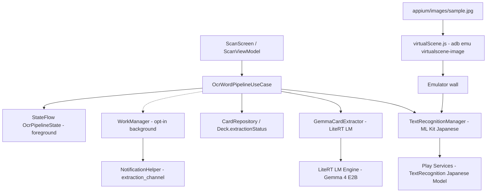

# Design Document — ScanCard OCR Pipeline (ML Kit + Gemma)

## Overview

`scancard-app-core` から OCR/単語生成を分離し、ML Kit（unbundled, Japanese）に OCR を集約、Gemma (LiteRT LM) はテキスト→単語生成のみを担う。パイプラインはフォアグラウンドが既定で、必要に応じ WorkManager 背景実行を opt-in で再利用する。`appium/images/sample.jpg` を Virtual Scene 経由で E2E 検証する。

## Architecture



### Technology Stack

| Layer | Technology | Purpose |
|-------|------------|---------|
| OCR | `play-services-mlkit-text-recognition:19.0.1` + `text-recognition-japanese:16.0.1` | Unbundled Japanese OCR (vertical/horizontal) |
| Word Gen | `litertlm-android:0.16.1` + `ai-delivery` | Gemma text→words only |
| Orchestration | `OcrWordPipelineUseCase` (Hilt) | OCR→Word→Persistence |
| State | `StateFlow<OcrPipelineState>` | Foreground progress for Compose |
| Background (opt-in) | WorkManager `dataSync` | Same as scancard-app-core Req12, reuse NotificationHelper |
| E2E | `virtualScene.js` + `mlkitOcrSample.e2e.js` | Sample image verification |

## Components and Interfaces

### ITextRecognitionManager

```kotlin
interface ITextRecognitionManager {
    suspend fun recognizeText(imageUri: Uri): String
    // Vertical/horizontal Japanese + English in one call, unbundled
}
```

- Impl `TextRecognitionManager`: `JapaneseTextRecognizerOptions.Builder().build()` の singleton client を `withContext(Dispatchers.IO)` で `downscaleIfNeeded(1080)` 後に `InputImage.fromBitmap` → `client.process(image).await()`。Uriは `loadBitmapScaled(1080)` でデコード時に縮小、Bitmapは直接縮小。`ModuleInstall` でモデル未取得時は `requestInstall` を 1 回試行。

### IWordGenerationExtractor

```kotlin
interface IWordGenerationExtractor {
    suspend fun isReady(): Boolean
    suspend fun generateWords(ocrText: String): List<ExtractedCard>
}
```

- Impl `GemmaCardExtractor` をラップ。プロンプトは `ocrText` のみ（画像バイトなし）。空文字は即 empty return。`PromptValidator` で無効エントリを除外し 1 回 retry。

### OcrWordPipelineUseCase

```kotlin
class OcrWordPipelineUseCase @Inject constructor(
    private val ocr: ITextRecognitionManager,
    private val wordGen: IWordGenerationExtractor,
    private val cardRepo: ICardRepository,
    private val deckRepo: IDeckRepository,
    private val validator: IPromptValidator,
) {
    sealed interface State { data object Idle; data class Ocring(val page:Int, val total:Int); data class Generating(val page:Int, val total:Int); data class Completed(val cards:List<Card>) }
    val state: StateFlow<State>
    suspend fun execute(deckId: Long, imageUris: List<Uri>): List<Card> // foreground
    fun enqueueBackground(deckId: Long, imageUris: List<Uri>): UUID // opt-in WorkManager
}
```

- `execute`: `imageUris.forEachIndexed { i, uri -> emit(Ocring); ocrText=ocr.recognizeText(uri); if(blank) continue; emit(Generating); words=wordGen.generateWords(ocrText); validated=validator.filter(words); repo.insert }` を逐次。順序保持。scope cancel で中断。

### Foreground vs Background

- Foreground (default): `ScanViewModel.viewModelScope.launch { pipeline.execute(deckId, uris) }`。`state` を Compose で collect、通知は出さない。
- Background (opt-in): `OcrWordPipelineWorker` が同じ `ocr→word` を実行し、`NotificationHelper.showProgressNotification(deckId, current, total)` を `deckId+100_000` で投稿。`scancard-app-core` の `dataSync` FGS と同一チャネル。

## Data Models

```kotlin
data class ExtractedCard(val term: String, val definition: String, val japaneseTranslation: String, val confidence: Float = 1f)
sealed interface OcrPipelineState { data object Idle; data class Ocring(val current:Int, val total:Int); data class Generating(val current:Int, val total:Int); data class Completed(val cards:List<Card>, val ocrTexts:List<String>); data class Failed(val reason:String) }
```

`Deck.extractionStatus` は本パイプラインでも `NONE→RUNNING→COMPLETED/FAILED` を使用（Room 既存）。OCRのみ成功で単語 0 でも `COMPLETED`（空 deck を許容）。

## Correctness Properties

- OCRは `sample.jpg` で非空テキストを返す（縦書き含む）。
- WordGen は画像を参照せず OCR テキストのみから生成する。
- OCR が空なら LLM を呼ばない。
- Foreground パイプラインは WorkManager なしで完了する。

## Error Handling

- `MlKitModelNotReady`: `ModuleInstall.requestInstall` を 1 回 retry、失敗で `Failed`。
- `InputImage` 失敗: ログ + `""` として次ページへ。
- LLM 失敗: `PromptValidator` で除外、1 回 retry、なお invalid なら skip。
- Background: `CancellationException` は rethrow で WorkManager 再スケジュール。

## Testing Strategy

- Unit: `TextRecognitionManager` を `Robolectric` + `MockK` で `recognizeText` の `Dispatchers.IO` 委譲と empty handling を検証。`OcrWordPipelineUseCase` は fake OCR/wordGen で `execute` の順序・空スキップ・`StateFlow` 遷移を検証。
- E2E: `mlkitOcrSample.e2e.js` で `sample.jpg` を Virtual Scene に投入 → `recognizeText` 非空 + （model Ready なら）≥1 card。`Idle` でも OCR 非空をassertし分離を証明。`@slow` は Gemma 時のみ。
- 手動: 初回 Play Services モデル取得の待ち時間を確認。

## Dependencies

| Dependency | Version | Purpose |
|------------|---------|---------|
| play-services-mlkit-text-recognition | 19.0.1 | Unbundled base |
| text-recognition-japanese | 16.0.1 | Japanese vertical/horizontal |
| kotlinx-coroutines-play-services | 1.11.0 | `await()` |
| play-services-base / module-install | latest | Model on-demand |
| litertlm-android | 0.16.1 | Gemma word gen |
| ai-delivery | 0.2.0-beta01 | Gemma model |
